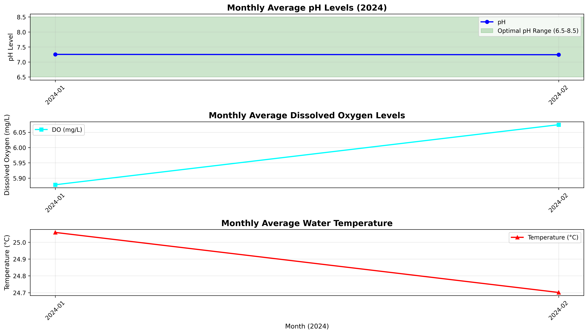

# 🚀 Guide to Upload Your Portfolio to GitHub

## Step 1: Create a GitHub Account
1. Go to [https://github.com/signup](https://github.com/signup)
2. Create an account if you don't have one

## Step 2: Create a New Repository
1. Log in to GitHub
2. Click the **+** icon in the top-right corner
3. Select **"New repository"**
4. Fill in the details:
   - **Repository name:** `water-quality-portfolio`
   - **Description:** `Environmental Data Science Portfolio - Water Quality Analysis`
   - **Public/Private:** Select **Public** (for portfolio visibility)
   - ✅ Check **"Add a README file"** (we already have one, but this is fine)
   - Click **"Create repository"**

## Step 3: Install Git on Your Computer
1. Download Git: [https://git-scm.com/download/win](https://git-scm.com/download/win)
2. Run the installer (use default settings)
3. Restart your terminal/PowerShell after installation

## Step 4: Upload Files Using GitHub Web Interface (Easiest Method)

### Option A: Drag and Drop (Recommended for beginners)
1. Go to your new repository on GitHub
2. Click **"uploading an existing file"** link
3. Open the folder: `C:\Users\omare\Desktop\Data_Scientist\water-quality-portfolio`
4. **Select all files** (Ctrl+A) and **drag them** into the GitHub upload area
5. Add a commit message: `"Initial commit: Add water quality analysis portfolio"`
6. Click **"Commit changes"**

### Option B: Using Git Command Line (After installing Git)

Open PowerShell and run these commands:

```powershell
# Navigate to your portfolio folder
cd "C:\Users\omare\Desktop\Data_Scientist\water-quality-portfolio"

# Initialize Git
git init

# Configure your GitHub credentials (replace with your info)
git config --global user.name "Your Name"
git config --global user.email "your.email@example.com"

# Add all files
git add .

# Commit the files
git commit -m "Initial commit: Add water quality analysis portfolio"

# Add your GitHub repository (replace with your username and repo URL)
git remote add origin https://github.com/YOUR_USERNAME/water-quality-portfolio.git

# Push to GitHub
git branch -M main
git push -u origin main
```

## Step 5: Verify Your Portfolio
1. Go to your repository on GitHub: `https://github.com/YOUR_USERNAME/water-quality-portfolio`
2. Ensure the README.md renders correctly with badges and images
3. Check that all files are present:
   - ✅ README.md
   - ✅ Water_Quality_Dataset.csv
   - ✅ water_quality_analysis.py
   - ✅ All 3 PNG images
   - ✅ Water_Quality_Analysis_Report.docx
   - ✅ LICENSE
   - ✅ requirements.txt

## Step 6: Share Your Portfolio
Add this link to your:
- ✉️ Email signature
- 💼 LinkedIn profile
- 📄 Resume/CV
- 🌐 Personal website

**Example:**  
*"Check out my water quality analysis portfolio: [github.com/YOUR_USERNAME/water-quality-portfolio](https://github.com/YOUR_USERNAME/water-quality-portfolio)"*

---

## 📝 Important Notes

### If Images Don't Show in README
Make sure the image paths in README.md use relative paths:
```markdown

```

### File Size Limits
- GitHub has a 100 MB file size limit per file
- Your .docx file (736 KB) and .ipynb file (13 KB) are well within limits

### Keeping Your Portfolio Updated
To update your portfolio later:
```powershell
git add .
git commit -m "Update: description of changes"
git push
```

---

## 🆘 Troubleshooting

**Problem:** Git not recognized  
**Solution:** Restart PowerShell after installing Git, or use the GitHub web interface

**Problem:** Authentication failed  
**Solution:** Use GitHub's web interface for uploading, or set up a Personal Access Token:  
[https://github.com/settings/tokens](https://github.com/settings/tokens)

**Problem:** Images not displaying  
**Solution:** Ensure images are in the root directory and paths in README are correct

---

## 🎉 Congratulations!

You now have a professional data science portfolio on GitHub that showcases:
- Python programming skills
- Data cleaning and analysis
- Data visualization
- Environmental science knowledge
- Technical documentation
- Real-world context (Morocco water quality article)
